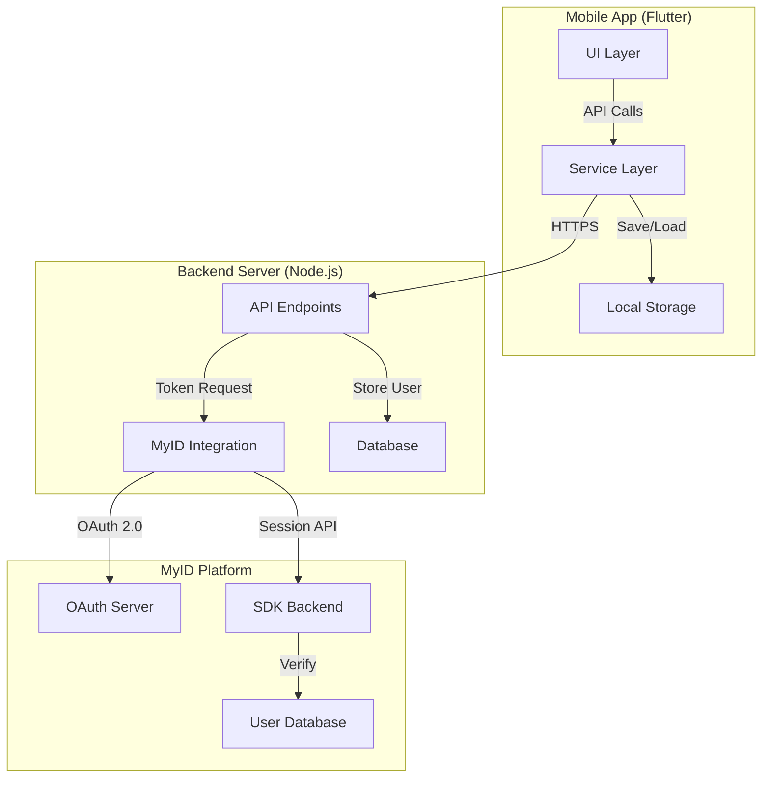
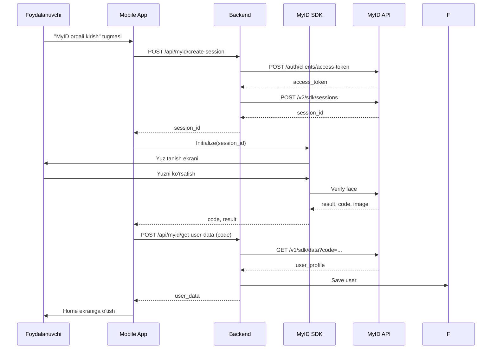

# Dizayn Hujjati: MyID Integratsiyasi

## Umumiy Ko'rinish

MyID integratsiyasi GreenMarket platformasiga O'zbekiston Respublikasi fuqarolarining pasport ma'lumotlari va yuz tanish texnologiyasi orqali xavfsiz autentifikatsiya qilish imkoniyatini beradi. Tizim OAuth 2.0 protokoli va MyID SDK yordamida ishlab chiqilgan.

### Asosiy Maqsadlar

1. **Xavfsizlik**: Foydalanuvchi ma'lumotlarini HTTPS va shifrlash orqali himoya qilish
2. **Foydalanish Qulayligi**: Oddiy va intuitiv autentifikatsiya jarayoni
3. **Ishonchlilik**: Xato holatlarini to'g'ri boshqarish va qayta urinish mexanizmi
4. **Miqyoslilik**: Ko'p foydalanuvchilarni qo'llab-quvvatlash
5. **Ko'p Tillilik**: O'zbek, Rus va Ingliz tillarida interfeys

### Texnologik Stek

**Backend:**
- Node.js 18+
- Express.js 4.x
- Axios (HTTP client)
- MyID API v1/v2

**Frontend:**
- Flutter 3.x
- Dart 3.x
- MyID SDK 3.1.41
- SharedPreferences (local storage)
- HTTP package

**Xavfsizlik:**
- HTTPS/TLS 1.3
- OAuth 2.0
- JWT tokens
- AES-256 shifrlash (maxfiy ma'lumotlar uchun)

## Arxitektura

### Umumiy Arxitektura Diagrammasi



### Autentifikatsiya Oqimi



## Komponentlar va Interfeyslar

### 1. Backend Komponentlari

#### 1.1. MyID Service (`myid_sdk_flow.js`)

**Mas'uliyat:** MyID API bilan to'g'ridan-to'g'ri integratsiya

**Funksiyalar:**

```javascript
// Access token olish
async function getAccessToken(): Promise<TokenResult>

// Sessiya yaratish (bo'sh yoki pasport bilan)
async function createSession(
  accessToken: string,
  passportData?: PassportData
): Promise<SessionResult>

// Foydalanuvchi ma'lumotlarini olish
async function retrieveUserData(
  accessToken: string,
  code: string
): Promise<UserDataResult>

// To'liq SDK oqimi
async function completeSdkFlow(
  passportData?: PassportData,
  code?: string
): Promise<CompleteFlowResult>
```

**Ma'lumot Tuzilmalari:**

```typescript
interface TokenResult {
  success: boolean;
  access_token?: string;
  expires_in?: number;
  error?: string;
}

interface PassportData {
  pass_data?: string;      // "AA1234567"
  pinfl?: string;          // "12345678901234"
  birth_date?: string;     // "1990-01-01"
  phone_number?: string;   // "+998901234567"
  is_resident?: boolean;   // true
  threshold?: number;      // 0.5 - 0.99
}

interface SessionResult {
  success: boolean;
  session_id?: string;
  expires_in?: number;
  error?: string;
}

interface UserDataResult {
  success: boolean;
  data?: {
    profile: UserProfile;
    result: string;
    comparison_value: number;
  };
  error?: string;
}

interface UserProfile {
  first_name: string;
  last_name: string;
  middle_name: string;
  birth_date: string;
  pinfl: string;
  pass_data: string;
  nationality: string;
  photo?: string;
}
```

#### 1.2. Express API Endpoints

**Endpoint 1: Sessiya Yaratish**

```
POST /api/myid/create-session
Content-Type: application/json

Request Body: {} (bo'sh - SDK o'zi pasport so'raydi)

Response:
{
  "data": {
    "session_id": "abc123...",
    "expires_in": 3600
  }
}
```

**Endpoint 2: Foydalanuvchi Ma'lumotlarini Olish**

```
POST /api/myid/sdk/get-user-data
Content-Type: application/json

Request Body:
{
  "code": "xyz789..."
}

Response:
{
  "success": true,
  "data": {
    "profile": {
      "first_name": "Sardor",
      "last_name": "Aliyev",
      "birth_date": "1990-01-01",
      "pinfl": "12345678901234",
      "pass_data": "AA1234567"
    },
    "comparison_value": 0.95
  }
}
```

**Endpoint 3: Access Token Olish (ixtiyoriy - test uchun)**

```
POST /api/myid/get-access-token
Content-Type: application/json

Response:
{
  "success": true,
  "data": {
    "access_token": "eyJhbGci...",
    "expires_in": 604800,
    "token_type": "Bearer"
  }
}
```

**Endpoint 4: Foydalanuvchilar Ro'yxati**

```
GET /api/users?page=1&limit=10&status=active

Response:
{
  "success": true,
  "data": {
    "users": [...],
    "pagination": {
      "total": 100,
      "page": 1,
      "limit": 10,
      "totalPages": 10
    },
    "stats": {
      "total_users": 100,
      "today_registrations": 5
    }
  }
}
```

### 2. Frontend Komponentlari

#### 2.1. MyID Backend Service (`myid_backend_service.dart`)

**Mas'uliyat:** Backend API bilan aloqa

**Metodlar:**

```dart
class MyIdBackendService {
  static const String backendUrl = 'https://greenmarket-backend-lilac.vercel.app';
  
  // Bo'sh sessiya yaratish
  static Future<Map<String, dynamic>> createEmptySession()
  
  // Access token olish
  static Future<Map<String, dynamic>> getAccessToken({
    required String clientId,
    required String clientSecret,
  })
  
  // Sessiya yaratish (pasport bilan)
  static Future<Map<String, dynamic>> createSession({
    required String accessToken,
    String? phoneNumber,
    String? birthDate,
    bool? isResident,
    String? pinfl,
    String? passData,
    double? threshold,
  })
  
  // To'liq sessiya yaratish (token + session)
  static Future<Map<String, dynamic>> createSessionWithToken({
    required String clientId,
    required String clientSecret,
    String? phoneNumber,
    String? birthDate,
    bool? isResident,
    String? pinfl,
    String? passData,
    double? threshold,
  })
  
  // Backend health check
  static Future<bool> checkBackendHealth()
}
```

#### 2.2. MyID Login Ekranlari

**MyIdMainLoginScreen** - Asosiy login ekrani
- MyID orqali kirish tugmasi
- Boshqa login usullari (telefon, email)
- Til tanlash

**MyIdSdkFlowScreen** - SDK oqimi ekrani
- Sessiya yaratish
- SDK ishga tushirish
- Natijani qayta ishlash
- Xato boshqaruvi

**MyIdProfileScreen** - Profil ekrani
- Foydalanuvchi ma'lumotlarini ko'rsatish
- Chiqish tugmasi
- Sozlamalar

#### 2.3. MyID SDK Integratsiyasi

**SDK Konfiguratsiyasi:**

```dart
final config = MyIdConfig(
  sessionId: sessionId,
  clientHash: MyIDConfig.clientHash,
  clientHashId: MyIDConfig.clientHashId,
  environment: MyIdEnvironment.PRODUCTION, // yoki DEBUG
  entryType: MyIdEntryType.IDENTIFICATION,
  locale: MyIdLocale.UZBEK, // yoki RUSSIAN, ENGLISH
);
```

**SDK Ishga Tushirish:**

```dart
final result = await MyIdClient.start(config: config);

if (result.code == '0') {
  // Muvaffaqiyatli
  final code = result.code;
  final image = result.image;
  // Backend'ga yuborish
} else if (result.code == '1') {
  // Bekor qilindi
  showError('Jarayon bekor qilindi');
} else {
  // Xato
  showError('Xatolik yuz berdi: ${result.code}');
}
```

## Ma'lumotlar Modellari

### Backend Ma'lumotlar Bazasi

**User Model:**

```javascript
{
  id: number,                    // Auto-increment
  session_id?: string,           // MyID session ID
  code?: string,                 // MyID code
  job_id?: string,               // MyID job ID
  profile_data: {
    first_name: string,
    last_name: string,
    middle_name: string,
    birth_date: string,          // "1990-01-01"
    pinfl: string,               // "12345678901234"
    pass_data: string,           // "AA1234567"
    nationality: string,
    photo?: string,              // Base64 yoki URL
  },
  comparison_value?: number,     // 0.0 - 1.0
  registered_at: string,         // ISO 8601
  last_login: string,            // ISO 8601
  status: 'active' | 'inactive',
  method: 'sdk_flow' | 'oauth' | 'sdk_flow_complete'
}
```

### Frontend Local Storage

**SharedPreferences Keys:**

```dart
// Foydalanuvchi ma'lumotlari
'user_data': JSON string
{
  'id': int,
  'myid_code': string,
  'session_id': string,
  'profile': {
    'first_name': string,
    'last_name': string,
    'birth_date': string,
    'pinfl': string,
    'pass_data': string,
  },
  'timestamp': string,
  'verified': bool,
}

// Til sozlamalari
'language': 'uz' | 'ru' | 'en'

// Access token (ixtiyoriy)
'access_token': string
'token_expiry': string
```

## Xato Boshqaruvi

### MyID SDK Xato Kodlari

| Kod | Ma'nosi | Harakat |
|-----|---------|---------|
| `0` | Muvaffaqiyatli | Davom etish |
| `1` | Bekor qilindi | Qayta urinish taklifi |
| `2` | Xato | Xato xabarini ko'rsatish |
| `3` | Timeout | Qayta urinish |

### HTTP Xato Kodlari

| Kod | Ma'nosi | Harakat |
|-----|---------|---------|
| `400` | Noto'g'ri so'rov | Validatsiya xatosini ko'rsatish |
| `401` | Autentifikatsiya xatosi | Token yangilash |
| `403` | Ruxsat yo'q | Foydalanuvchiga xabar berish |
| `404` | Topilmadi | Xato xabarini ko'rsatish |
| `429` | Juda ko'p so'rovlar | Kutish va qayta urinish |
| `500` | Server xatosi | Texnik yordam uchun xabar |
| `503` | Xizmat mavjud emas | Keyinroq qayta urinish |

### Qayta Urinish Strategiyasi

**Eksponensial Backoff:**

```dart
Future<T> retryWithBackoff<T>({
  required Future<T> Function() operation,
  int maxRetries = 3,
  Duration initialDelay = const Duration(seconds: 1),
}) async {
  int attempt = 0;
  Duration delay = initialDelay;
  
  while (attempt < maxRetries) {
    try {
      return await operation();
    } catch (e) {
      attempt++;
      if (attempt >= maxRetries) rethrow;
      
      await Future.delayed(delay);
      delay *= 2; // Eksponensial oshirish
    }
  }
  
  throw Exception('Maksimal urinishlar soni oshdi');
}
```

**Foydalanish:**

```dart
final result = await retryWithBackoff(
  operation: () => MyIdBackendService.createEmptySession(),
  maxRetries: 3,
);
```

### Xato Xabarlari (Ko'p Tillilik)

```dart
final errorMessages = {
  'network_error': {
    'uz': 'Tarmoq bilan bog\'lanishda xatolik',
    'ru': 'Ошибка подключения к сети',
    'en': 'Network connection error',
  },
  'session_expired': {
    'uz': 'Sessiya muddati tugadi',
    'ru': 'Срок действия сессии истек',
    'en': 'Session expired',
  },
  'verification_failed': {
    'uz': 'Identifikatsiya muvaffaqiyatsiz',
    'ru': 'Идентификация не удалась',
    'en': 'Verification failed',
  },
  'server_error': {
    'uz': 'Server xatosi. Keyinroq qayta urinib ko\'ring',
    'ru': 'Ошибка сервера. Попробуйте позже',
    'en': 'Server error. Please try again later',
  },
};
```

## Correctness Properties (To'g'rilik Xususiyatlari)

Property (xususiyat) - bu tizimning barcha to'g'ri bajarilishlarida saqlanishi kerak bo'lgan xususiyat yoki xatti-harakat. Propertylar inson o'qiy oladigan spetsifikatsiyalar va mashina tekshira oladigan to'g'rilik kafolatlari o'rtasidagi ko'prik vazifasini bajaradi.

### Backend Properties

**Property 1: OAuth Token Olish va Saqlash**

*Har qanday* to'g'ri client_id va client_secret bilan, backend access token olishi, uni xavfsiz saqlashi va 7 kun davomida qayta ishlatishi kerak. Token muddati tugaganda avtomatik yangilanishi kerak.

**Validates: Requirements 1.1, 1.2, 1.3, 1.5**

**Property 2: Sessiya Yaratish Parametrlari**

*Har qanday* sessiya yaratish so'rovida, agar ixtiyoriy parametrlar (pass_data, pinfl, birth_date, phone_number) berilgan bo'lsa, backend ularni MyID API'ga to'g'ri formatda yuborishi kerak.

**Validates: Requirements 2.3, 2.4**

**Property 3: Sessiya Yaratish Javob Formati**

*Har qanday* muvaffaqiyatli sessiya yaratish so'rovida, backend session_id va expires_in maydonlarini o'z ichiga olgan JSON javob qaytarishi kerak.

**Validates: Requirements 2.2, 2.5**

**Property 4: Xato Holatlarini Boshqarish**

*Har qanday* xato holatida (tarmoq xatosi, timeout, 4xx/5xx kodlar), backend xato tafsilotlarini log qilishi va foydalanuvchiga tushunarli xato xabarini qaytarishi kerak.

**Validates: Requirements 1.4, 2.6, 6.1, 6.5, 6.6**

**Property 5: Foydalanuvchi Ma'lumotlarini Saqlash**

*Har qanday* MyID'dan olingan foydalanuvchi ma'lumotlari uchun, backend ma'lumotlarni ma'lumotlar bazasiga saqlashi va User_Profile formatida qaytarishi kerak.

**Validates: Requirements 4.4, 4.5**

**Property 6: HTTPS Protokoli**

*Har qanday* MyID API so'rovida, backend HTTPS protokolidan foydalanishi kerak (URL https:// bilan boshlanishi kerak).

**Validates: Requirements 5.1**

**Property 7: Maxfiy Ma'lumotlarni Himoya Qilish**

*Har qanday* API javobida, backend client_secret'ni qaytarmasligi kerak. Ma'lumotlar bazasida maxfiy ma'lumotlar (pasport, PINFL) shifrlangan formatda saqlanishi kerak.

**Validates: Requirements 5.3, 5.4**

**Property 8: Rate Limiting**

*Har qanday* IP manzildan 1 daqiqada 10 tadan ortiq so'rov yuborilsa, backend 429 status kodi bilan rad etishi kerak.

**Validates: Requirements 5.8**

**Property 9: Qayta Urinish Mexanizmi**

*Har qanday* timeout xatosida, backend maksimal 3 marta eksponensial backoff bilan qayta urinishi kerak.

**Validates: Requirements 6.2**

**Property 10: API Endpoint Javob Formati**

*Har qanay* API endpoint so'rovida, backend JSON formatida javob qaytarishi va xato holatlarida to'g'ri HTTP status kodlarini (400, 401, 500) ishlatishi kerak.

**Validates: Requirements 9.7, 9.8**

### Frontend Properties

**Property 11: SDK Ishga Tushirish**

*Har qanday* to'g'ri session_id bilan, mobile app MyID SDK'ni to'g'ri konfiguratsiya (clientHash, clientHashId, environment, locale) bilan ishga tushirishi kerak.

**Validates: Requirements 3.1**

**Property 12: SDK Natijalarini Qayta Ishlash**

*Har qanday* SDK natijasi uchun, mobile app code qiymatiga qarab to'g'ri harakat qilishi kerak:
- code="0": Muvaffaqiyatli, keyingi bosqichga o'tish
- code="1": Bekor qilindi, qayta urinish taklifi
- code="2" yoki "3": Xato, xato xabarini ko'rsatish

**Validates: Requirements 3.6, 3.7, 3.8**

**Property 13: Loading Holatini Ko'rsatish**

*Har qanday* asinxron jarayon (sessiya yaratish, SDK ishga tushirish, ma'lumot olish) davomida, mobile app loading indikator va holat xabarini ko'rsatishi kerak.

**Validates: Requirements 3.3, 8.3**

**Property 14: Xato Xabarlarini Ko'rsatish**

*Har qanday* xato holatida, mobile app foydalanuvchiga tushunarli xato xabarini va "Qayta urinish" tugmasini ko'rsatishi kerak.

**Validates: Requirements 3.5, 8.6**

**Property 15: Ko'p Tillilik Qo'llab-quvvatlash**

*Har qanday* til tanlanganda (uz, ru, en), mobile app barcha interfeys elementlari, xato xabarlari va SDK'ni tanlangan tilda ko'rsatishi kerak. Tanlangan til local storage'da saqlanishi va keyingi kirishda avtomatik qo'llanishi kerak.

**Validates: Requirements 7.1, 7.2, 7.3, 7.4, 7.5**

**Property 16: Sessiya Ma'lumotlarini Tozalash**

*Har qanday* logout jarayonida, mobile app barcha sessiya ma'lumotlarini (session_id, access_token, user_data) local storage'dan o'chirishi kerak.

**Validates: Requirements 5.7**

**Property 17: Accessibility Qo'llab-quvvatlash**

*Har qanday* UI elementi (tugma, matn, rasm) uchun, mobile app screen reader uchun semantics ma'lumotlarini taqdim etishi kerak.

**Validates: Requirements 8.7**

**Property 18: Jarayon Bosqichlarini Ko'rsatish**

*Har qanday* MyID autentifikatsiya jarayonida, mobile app joriy bosqichni (1/4, 2/4, 3/4, 4/4) ko'rsatishi kerak.

**Validates: Requirements 8.2**

### Integratsiya Properties

**Property 19: To'liq Autentifikatsiya Oqimi**

*Har qanday* to'g'ri foydalanuvchi ma'lumotlari bilan, tizim quyidagi ketma-ketlikni muvaffaqiyatli bajarishi kerak:
1. Backend access token oladi
2. Backend sessiya yaratadi va session_id qaytaradi
3. Mobile app SDK'ni ishga tushiradi
4. SDK yuz tanish jarayonini bajaradi va code qaytaradi
5. Mobile app code'ni backend'ga yuboradi
6. Backend foydalanuvchi ma'lumotlarini oladi va saqlaydi
7. Mobile app foydalanuvchini home ekraniga yo'naltiradi

**Validates: Requirements 1.1, 2.2, 3.1, 3.4, 4.1, 4.2, 4.4**

**Property 20: Xavfsiz Ma'lumot Uzatish**

*Har qanday* foydalanuvchi ma'lumotlari uzatilishida, tizim HTTPS protokolidan foydalanishi, maxfiy ma'lumotlarni shifrlashi va client_secret'ni frontend'ga yubormasligi kerak.

**Validates: Requirements 5.1, 5.3, 5.4**

### Edge Case Properties

**Property 21: Bo'sh Sessiya Yaratish**

*Har qanday* bo'sh sessiya yaratish so'rovida (pasport ma'lumotlarisiz), backend MyID API'ga bo'sh obyekt yuborishi va SDK o'zi pasport ekranini ko'rsatishi kerak.

**Validates: Requirements 2.1, 2.2**

**Property 22: Muddati Tugagan Sessiya**

*Har qanday* muddati tugagan sessiya bilan SDK ishga tushirish urinishida, tizim xato qaytarishi va yangi sessiya yaratishni taklif qilishi kerak.

**Validates: Requirements 2.7**

**Property 23: Maksimal Qayta Urinishlar**

*Har qanday* 3 marta muvaffaqiyatsiz qayta urinishdan keyin, mobile app "Keyinroq qayta urinib ko'ring" xabarini ko'rsatishi va jarayonni to'xtatishi kerak.

**Validates: Requirements 6.4**

## Testing Strategy (Test Strategiyasi)

### Ikki Tomonlama Test Yondashuvi

MyID integratsiyasini to'liq test qilish uchun biz ikkita to'ldiruvchi test usulidan foydalanamiz:

1. **Unit Testlar**: Aniq misollar, edge caselar va xato holatlarini tekshiradi
2. **Property-Based Testlar**: Universal propertylarni barcha kiritmalarda tekshiradi

Ikkala usul ham zarur va bir-birini to'ldiradi:
- Unit testlar aniq buglarni ushlaydi
- Property testlar umumiy to'g'rilikni tasdiqlaydi

### Backend Testing

#### Unit Testlar

**Test Framework:** Jest yoki Mocha

**Test Qamrovi:**
- MyID API integratsiyasi (mock API bilan)
- Express endpoint'lar
- Xato boshqaruvi
- Token saqlash va yangilash
- Ma'lumotlar bazasi operatsiyalari

**Misol Unit Test:**

```javascript
describe('MyID Service', () => {
  describe('getAccessToken', () => {
    it('should return access token with valid credentials', async () => {
      const result = await getAccessToken();
      
      expect(result.success).toBe(true);
      expect(result.access_token).toBeDefined();
      expect(result.expires_in).toBe(604800);
    });
    
    it('should handle invalid credentials', async () => {
      const result = await getAccessToken('invalid', 'invalid');
      
      expect(result.success).toBe(false);
      expect(result.error).toBeDefined();
    });
  });
});
```

#### Property-Based Testlar

**Test Framework:** fast-check (JavaScript)

**Konfiguratsiya:**
- Har bir property test uchun minimum 100 iteratsiya
- Har bir test dizayn hujjatidagi property'ga havola qiladi
- Tag formati: `Feature: myid-integration-v2, Property {raqam}: {property matni}`

**Misol Property Test:**

```javascript
const fc = require('fast-check');

describe('Property Tests', () => {
  // Feature: myid-integration-v2, Property 2: Sessiya Yaratish Parametrlari
  it('should include optional parameters in session request', () => {
    fc.assert(
      fc.property(
        fc.record({
          pass_data: fc.option(fc.string()),
          pinfl: fc.option(fc.string()),
          birth_date: fc.option(fc.date()),
          phone_number: fc.option(fc.string()),
        }),
        async (params) => {
          const result = await createSession('test_token', params);
          
          // Agar parametr berilgan bo'lsa, so'rovda bo'lishi kerak
          if (params.pass_data) {
            expect(result.requestBody).toHaveProperty('pass_data', params.pass_data);
          }
          if (params.pinfl) {
            expect(result.requestBody).toHaveProperty('pinfl', params.pinfl);
          }
        }
      ),
      { numRuns: 100 }
    );
  });
});
```

### Frontend Testing

#### Widget Testlar

**Test Framework:** Flutter Test

**Test Qamrovi:**
- MyID login ekranlari
- SDK integratsiyasi
- Loading holatlar
- Xato xabarlari
- Ko'p tillilik
- Accessibility

**Misol Widget Test:**

```dart
testWidgets('MyID login screen shows login button', (WidgetTester tester) async {
  await tester.pumpWidget(MyApp());
  
  // Login ekraniga o'tish
  await tester.tap(find.text('MyID orqali kirish'));
  await tester.pumpAndSettle();
  
  // Tugma mavjudligini tekshirish
  expect(find.text('MyID orqali kirish'), findsOneWidget);
  expect(find.byType(ElevatedButton), findsWidgets);
});
```

#### Property-Based Testlar (Dart)

**Test Framework:** test_api + custom generators

**Misol Property Test:**

```dart
// Feature: myid-integration-v2, Property 15: Ko'p Tillilik Qo'llab-quvvatlash
test('all UI elements should be translated for each language', () {
  final languages = ['uz', 'ru', 'en'];
  
  for (final lang in languages) {
    testWidgets('UI elements in $lang', (WidgetTester tester) async {
      await tester.pumpWidget(MyApp(locale: Locale(lang)));
      
      // Barcha matnlar tarjima qilingan bo'lishi kerak
      expect(find.text('MyID orqali kirish'), findsNothing); // Hardcoded matn yo'q
      expect(find.byType(Text), findsWidgets); // Tarjima qilingan matnlar bor
    });
  }
});
```

### Integratsiya Testlari

**Test Qamrovi:**
- To'liq autentifikatsiya oqimi (end-to-end)
- Backend va frontend o'rtasidagi aloqa
- MyID API bilan integratsiya (staging muhitida)

**Misol Integratsiya Test:**

```javascript
describe('Full Authentication Flow', () => {
  // Feature: myid-integration-v2, Property 19: To'liq Autentifikatsiya Oqimi
  it('should complete full authentication flow', async () => {
    // 1. Access token olish
    const tokenResult = await getAccessToken();
    expect(tokenResult.success).toBe(true);
    
    // 2. Sessiya yaratish
    const sessionResult = await createSession(tokenResult.access_token);
    expect(sessionResult.success).toBe(true);
    
    // 3. SDK simulyatsiya qilish (mock)
    const sdkResult = { code: '0', result: 'success' };
    
    // 4. Foydalanuvchi ma'lumotlarini olish
    const userResult = await retrieveUserData(tokenResult.access_token, sdkResult.code);
    expect(userResult.success).toBe(true);
    expect(userResult.data.profile).toBeDefined();
  });
});
```

### Test Coverage Maqsadlari

- **Backend**: Kamida 80% kod qamrovi
- **Frontend**: Kamida 70% widget qamrovi
- **Property Testlar**: Har bir property uchun kamida 100 iteratsiya
- **Integratsiya Testlar**: Barcha asosiy oqimlar qamrab olingan

### Mock va Stub'lar

**Backend Mock'lar:**
- MyID API mock serveri (test uchun)
- Ma'lumotlar bazasi mock'i (in-memory)

**Frontend Mock'lar:**
- MyID SDK mock'i (yuz tanish simulyatsiyasi)
- Backend API mock'i (network testlari uchun)

**Misol Mock:**

```javascript
// MyID API Mock
const mockMyIdApi = {
  getAccessToken: jest.fn().mockResolvedValue({
    access_token: 'mock_token',
    expires_in: 604800,
  }),
  createSession: jest.fn().mockResolvedValue({
    session_id: 'mock_session',
    expires_in: 3600,
  }),
};
```

### CI/CD Integratsiyasi

**Test Jarayoni:**
1. Har bir commit'da unit testlar ishga tushadi
2. Pull request'larda property testlar ishga tushadi
3. Merge'dan oldin integratsiya testlari ishga tushadi
4. Production'ga deploy'dan oldin barcha testlar o'tishi kerak

**Test Komandalar:**

```bash
# Backend testlar
npm test                    # Unit testlar
npm run test:property       # Property testlar
npm run test:integration    # Integratsiya testlari
npm run test:coverage       # Coverage hisoboti

# Frontend testlar
flutter test                # Widget testlar
flutter test --coverage     # Coverage hisoboti
```

### Test Ma'lumotlari

**Test Foydalanuvchilari:**
- To'g'ri pasport ma'lumotlari (test muhiti uchun)
- Noto'g'ri pasport ma'lumotlari (xato testlari uchun)
- Turli xil PINFL'lar

**Test Sessiyalari:**
- Bo'sh sessiyalar
- Pasport bilan sessiyalar
- Muddati tugagan sessiyalar

### Xavfsizlik Testlari

**Test Qamrovi:**
- SQL injection
- XSS hujumlari
- CSRF himoyasi
- Rate limiting
- Token xavfsizligi

**Misol Xavfsizlik Test:**

```javascript
describe('Security Tests', () => {
  it('should prevent SQL injection', async () => {
    const maliciousInput = "'; DROP TABLE users; --";
    const result = await createSession('token', { pass_data: maliciousInput });
    
    // Ma'lumotlar bazasi buzilmasligi kerak
    expect(result.success).toBe(false);
    expect(result.error).toContain('Invalid input');
  });
  
  // Feature: myid-integration-v2, Property 8: Rate Limiting
  it('should enforce rate limiting', async () => {
    const requests = Array(11).fill().map(() => createSession('token'));
    const results = await Promise.all(requests);
    
    // 11-chi so'rov rad etilishi kerak
    expect(results[10].success).toBe(false);
    expect(results[10].error).toContain('429');
  });
});
```

