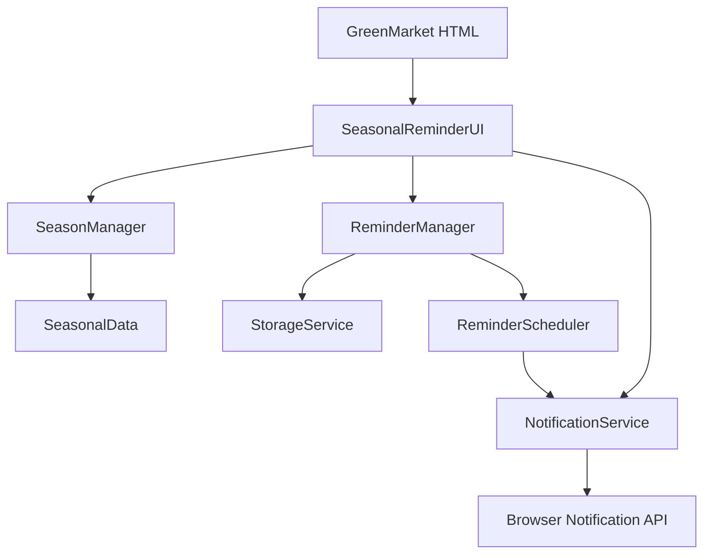

# Design Document

## Overview

"Mavsumiy Eslatgich" bo'limi GreenMarket platformasiga qo'shiladigan mustaqil modul bo'lib, foydalanuvchilarga yil davomida bog'bonchilik ishlari haqida ma'lumot beradi va shaxsiy eslatma tizimini taqdim etadi. Tizim to'rtta asosiy komponentdan iborat:

1. **Mavsumiy Ma'lumot Ko'rsatish** - Har bir mavsum uchun ishlar ro'yxati
2. **Hozirgi Oy Maslahati** - Joriy oyga mos tavsiyalar
3. **Eslatma Tizimi** - Foydalanuvchi tomonidan sozlanadigan eslatmalar
4. **Eslatmalar Tarixi** - Bajarilgan va o'tkazib yuborilgan ishlar ro'yxati

Tizim to'liq client-side da ishlaydi, localStorage dan foydalanadi va brauzer Notification API orqali eslatmalar yuboradi.

## Architecture

### Umumiy Arxitektura



### Komponentlar Tuzilishi

Tizim quyidagi asosiy komponentlardan tashkil topgan:

1. **UI Layer** - Foydalanuvchi interfeysi va ko'rinishlar
2. **Business Logic Layer** - Mavsumiy ma'lumotlar va eslatmalar logikasi
3. **Data Layer** - Ma'lumotlarni saqlash va yuklash
4. **Notification Layer** - Eslatmalarni yuborish

## Components and Interfaces

### 1. SeasonalData

Mavsumiy ma'lumotlarni saqlash va taqdim etish uchun statik data moduli.

```javascript
// src/models/SeasonalData.js
class SeasonalData {
    constructor() {
        this.seasons = {
            spring: {
                name: 'Bahor',
                emoji: '🌸',
                months: 'Mart - May',
                monthRange: [3, 4, 5],
                tasks: [
                    'Daraxt va butalarni kesish',
                    'Urug\' ekish vaqti',
                    'O\'g\'it berish',
                    'Ko\'chatlarni ko\'chirish'
                ],
                color: 'green'
            },
            summer: {
                name: 'Yoz',
                emoji: '☀️',
                months: 'Iyun - Avgust',
                monthRange: [6, 7, 8],
                tasks: [
                    'Muntazam sug\'orish',
                    'Begona o\'tlarni tozalash',
                    'Meva yig\'ish',
                    'Zararkunandalardan himoya'
                ],
                color: 'yellow'
            },
            autumn: {
                name: 'Kuz',
                emoji: '🍂',
  